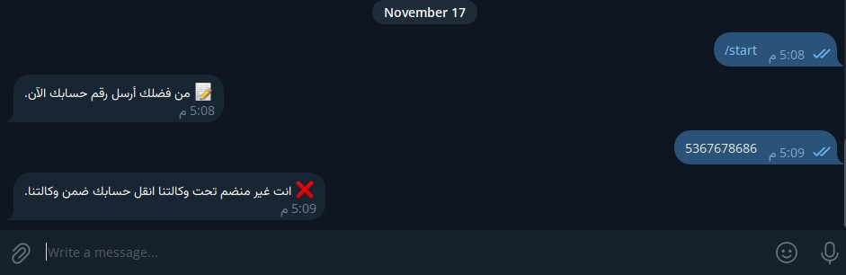
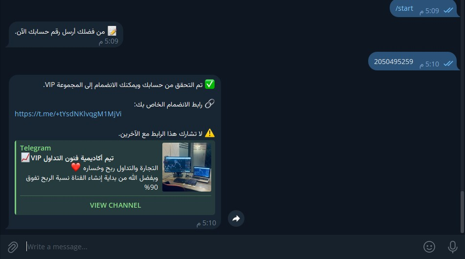

# Telegram VIP Verification Bot

A secure Telegram bot designed for Forex and Crypto agencies to automate VIP group access verification and onboarding.

---

## Bot Demo


---

## Overview

This bot automatically verifies users using their trading account number.

If the account belongs to the agency and meets the required balance conditions, the bot generates a secure private Telegram invite link for the VIP group.

The system prevents unauthorized access, duplicate account usage, and invite link sharing.

---

## Features

* Secure client verification system
* Excel-based account validation
* Minimum balance checking
* Private one-time Telegram invite links
* Duplicate account protection
* Fully automated VIP onboarding
* Arabic Telegram interface
* Easy account database management

---

## How It Works

1. User starts the bot using `/start`
2. Bot asks for the account number
3. System verifies:

   * account exists
   * account belongs to the agency
   * account balance meets requirements
4. Bot generates a private invite link
5. User receives access to the VIP group

---

## Screenshots

### Welcome Interface


### Invalid Account Detection



### Minimum Balance Validation


### Successful VIP Verification



### Duplicate Account Protection


---

## Technologies Used

* Python
* python-telegram-bot
* Pandas
* OpenPyXL
* Telegram Bot API

---

## Project Structure

```bash
telegram-vip-verification-bot/
│
├── bot.py
├── requirements.txt
├── README.md
├── .gitignore
├── accounts.xlsx
├── invite_links_example.json
│
└── screenshots/
    ├── welcome-screen.jpg
    ├── invalid-account.jpg
    ├── low-balance.jpg
    ├── success-access.jpg
    └── duplicate-account.jpg
	└── bot-demo.gif
	└── bot-demo.mp4
	└── Boot Show.pdf
```

---

## Installation

Clone the repository:

```bash
git clone https://github.com/your-username/telegram-vip-verification-bot.git
cd telegram-vip-verification-bot
```

Install dependencies:

```bash
pip install -r requirements.txt
```

---

## Configuration

Create a `.env` file:

```env
BOT_TOKEN=your_telegram_bot_token
VIP_GROUP_ID=your_vip_group_id
```

---

## Run the Bot

```bash
python bot.py
```

---

## Security Notice

This repository does not contain:

* real client data
* private Telegram invite links
* production bot tokens
* private group identifiers

---

## Real-world Use Case

This project was developed as a real-world automation solution for a Forex/Crypto agency to manage VIP Telegram community access securely and efficiently.

---

## Future Improvements

* Database integration
* Admin dashboard
* Multi-language support
* Expiring invite links
* User analytics system
* API-based account synchronization

---

## Author

Developed by Ahmed Khamis
